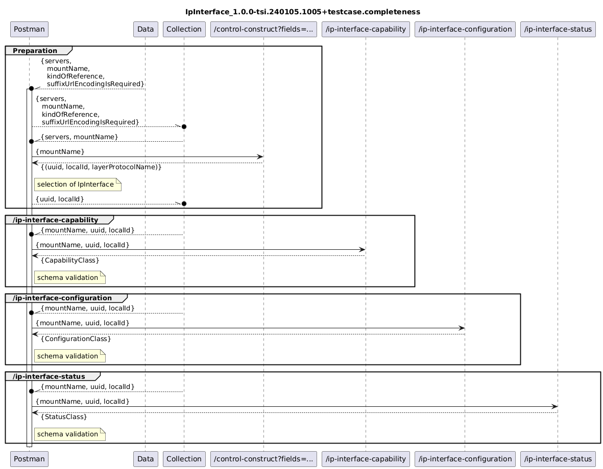

# IpInterface_1.0.0-tsi.240105.1005+validator

### Completeness
- [IpInterface_1.0.0-tsi.240105.1005+validator.completeness](./Completeness/IpInterface_1.0.0-tsi.240105.1005+validator.completeness.json)  
- [IpInterface_1.0.0-tsi.240105.1005+data.completeness](./Completeness/IpInterface_1.0.0-tsi.240105.1005+data.completeness.json)  
-   
